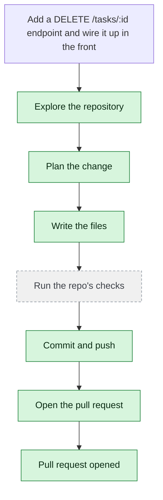

# singhc-wwt/example-three-tier-application — 2026-08-06

> Add a DELETE /tasks/:id endpoint and wire it up in the frontend

| | |
| --- | --- |
| Job | `adefdc0a-0152-4a07-8328-6fd2f2f66dc1` |
| Repository | [singhc-wwt/example-three-tier-application](https://github.com/singhc-wwt/example-three-tier-application) |
| Base branch | `main` |
| Work branch | [`agent/adefdc0a`](https://github.com/singhc-wwt/example-three-tier-application/tree/agent/adefdc0a) |
| Pull request | https://github.com/singhc-wwt/example-three-tier-application/pull/14 |
| Duration | 65.0s |
| Logs | [CloudWatch Logs Insights](https://us-east-1.console.aws.amazon.com/cloudwatch/home?region=us-east-1#logsV2:logs-insights?queryDetail=~(end~'2026-08-06T03%3A33%3A58.241Z~start~'2026-08-06T03%3A30%3A53.271Z~timeType~'ABSOLUTE~tz~'UTC~editorString~'fields*20*40timestamp*2C*20level*2C*20msg*2C*20jobId*0A*7C*20filter*20jobId*20*3D*20'adefdc0a-0152-4a07-8328-6fd2f2f66dc1'*20or*20*40message*20like*20'adefdc0a-0152-4a07-8328-6fd2f2f66dc1'*0A*7C*20sort*20*40timestamp*20asc*0A*7C*20limit*20500~source~(~'*2Faine-forge*2Forchestrator))) |

## How the run went

The agent was asked to work in **singhc-wwt/example-three-tier-application** from `main`. It began by exploring the repository rather than guessing: it opened 4 file(s) — `src/api/index.js`, `src/api/db.js`, `src/web/app/page.tsx`, `src/web/app/actions.ts`.

From what it read, it settled on 3 step(s):

1. **Add DELETE /tasks/:id endpoint in the backend API** — Add a DELETE endpoint handler in src/api/index.js that accepts a task ID, deletes the task from the database, and returns a 204 No Content response or confirmation.
1. **Add deleteTask server action in the frontend** — Add a new async function deleteTask in src/web/app/actions.ts that calls the DELETE endpoint and revalidates the path.
1. **Add delete button to the task list UI** — Update src/web/app/page.tsx to include a delete button for each task that calls the deleteTask action with the task ID.

It then wrote 3 file(s) — `src/api/index.js`, `src/web/app/actions.ts`, `src/web/app/page.tsx` — committing each to `agent/adefdc0a` as it went. Nothing was committed to the base branch: the only route there is the pull request.

The run ends at https://github.com/singhc-wwt/example-three-tier-application/pull/14, ready for review.

## The route it took

## Every step, in order

| # | Time | Step | What happened |
| --- | --- | --- | --- |
| 1 | 03:31:53 | `message` | Working in singhc-wwt/example-three-tier-application |
| 2 | 03:31:53 | `state` | Agent state: planning |
| 3 | 03:31:56 | `run` | Listed / — 7 entries |
| 4 | 03:31:59 | `run` | Listed src — 4 entries — `src` |
| 5 | 03:32:01 | `run` | Listed src/api — 6 entries — `src/api` |
| 6 | 03:32:02 | `run` | Listed src/db — 5 entries — `src/db` |
| 7 | 03:32:02 | `run` | Listed src/web — 14 entries — `src/web` |
| 8 | 03:32:04 | `run` | Listed src/web/app — 5 entries — `src/web/app` |
| 9 | 03:32:05 | `run` | Read src/api/index.js — `src/api/index.js` |
| 10 | 03:32:06 | `run` | Read src/api/db.js — `src/api/db.js` |
| 11 | 03:32:08 | `run` | Read src/web/app/page.tsx — `src/web/app/page.tsx` |
| 12 | 03:32:09 | `run` | Read src/web/app/actions.ts — `src/web/app/actions.ts` |
| 13 | 03:32:13 | `plan` | Add DELETE /tasks/:id endpoint in the backend API — `Add a DELETE endpoint handler in src/api/index.js that accepts a task ID, deletes the task from the database, and returns a 204 No Content response or confirmat` |
| 14 | 03:32:13 | `plan` | Add deleteTask server action in the frontend — `Add a new async function deleteTask in src/web/app/actions.ts that calls the DELETE endpoint and revalidates the path.` |
| 15 | 03:32:13 | `plan` | Add delete button to the task list UI — `Update src/web/app/page.tsx to include a delete button for each task that calls the deleteTask action with the task ID.` |
| 16 | 03:32:14 | `commit` | Created branch agent/adefdc0a |
| 17 | 03:32:14 | `state` | Agent state: executing |
| 18 | 03:32:19 | `run` | Read src/api/index.js — `src/api/index.js` |
| 19 | 03:32:19 | `run` | Read src/web/app/actions.ts — `src/web/app/actions.ts` |
| 20 | 03:32:20 | `run` | Read src/web/app/page.tsx — `src/web/app/page.tsx` |
| 21 | 03:32:26 | `edit` | Wrote src/api/index.js — `src/api/index.js` |
| 22 | 03:32:30 | `edit` | Wrote src/web/app/actions.ts — `src/web/app/actions.ts` |
| 23 | 03:32:39 | `edit` | Wrote src/web/app/page.tsx — `src/web/app/page.tsx` |
| 24 | 03:32:41 | `run` | git status — 3 file(s) changed |
| 25 | 03:32:43 | `run` | git diff |
| 26 | 03:32:49 | `run` | Committed 4d8b618 |
| 27 | 03:32:53 | `state` | Agent state: observing |
| 28 | 03:32:53 | `push` | Pushed 3 file(s) to agent/adefdc0a |
| 29 | 03:32:58 | `pr` | Opened PR #14 — `https://github.com/singhc-wwt/example-three-tier-application/pull/14` |

---

_Generated by the FORGE code agent. Each interaction gets its own file in `docs/runs/`._